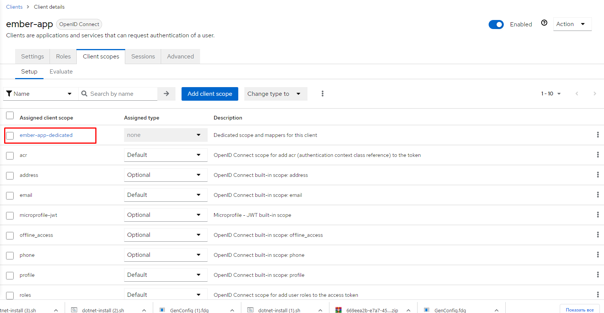
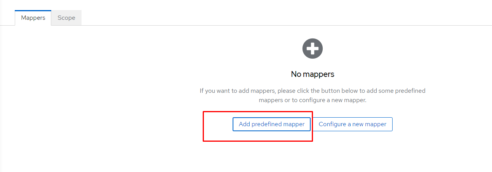
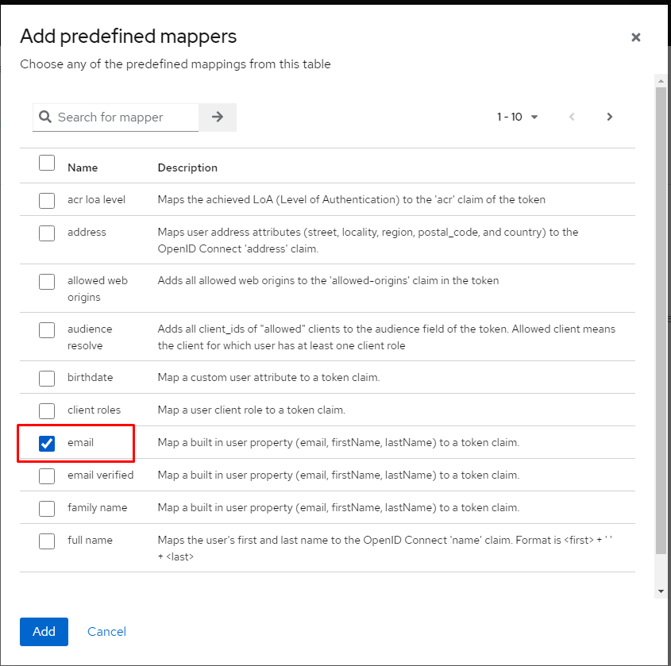

# Инструкция по настройке keycloack для проекта

Веб-интерфейс доступен по адресу <http://localhost:8080> (логин: admin, пароль: admin). Переходим в консоль администратора

   

## Создаем нового клиента

1. Заходим в меню Clients
2. Нажимаем `Create client`
3. Заполняем `Client ID = ember-app`. Нажимаем Next
4. Должна стоять галочка `Authentication flow = Standard flow`. Нажимаем Save
5. Нас перекинуло в настройки созданного клиента. Здесь ставим `*` в полях `Valid redirect URIs`, `Valid post logout redirect URIs`, `Web origins`
6. Нажимаем Save

## Создаем пользователя

1. Переходим в меню User. Нажимаем `Create user`.
2. Заполняем Username и Email (нужен для отчетов), нажимаем Create.
3. Открываются настройки созданного пользователя. Переходим во вкладку `Credentials`, нажимаем Set password. Задаем пароль. Нажимаем Save, затем подтверждаем еще раз.

## Включаем email в клаймы

Заходим в Clients, выбираем ember-app. Далее

## Задаем роли

1. В меню `Clients` заходим в созданного клиента, открываем вкладку `Roles`
2. Нажимем Create role, вводим имя, сохраняем (в системе полномочий проекта используются роли AllAccess и NoAccess)
3. В меню `Users` выбираем пользователя, заходим во вкладку `Role mapping`
4. Нажимаем `Assign role`, в фильтре выбираем clients - имя клиента. В списке появятся роли выбранного клиента. Ставим галочку у нужной, нажимаем Assign
