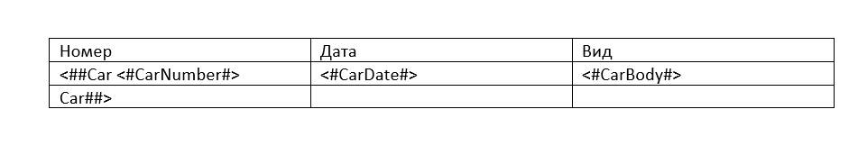

# Построение отчета

## Пакет NewPlatform.Flexberry.OpenXmlPowerTools.Reports

1. Пакет предназначен для поиска и замены параметров внутри заданного WORD-шаблона (.docx). Устанавливается через nuget-manager
2. DocxReport - основной класс, конструктор которого принимает единственный параметр - строку, состоящую из пути и названия шаблона, например:

    **var template = new DocxReport(Path.Combine("Templates", "Cars.docx"));**

    (*Прим.*) В данном случае папка **Templates** находится прямо в **ODataBackend**, поэтому путь не полный.
3. Для построения отчета необходимо вызвать метод данного класса:

    **template.BuildWithParameters(parameters);**
    где *parameters* - переменная типа **Dictionary<string, object>**

4. Чтобы сохранить отчет, в пакете предусмотрено 2 реализации метода **template.SaveAs(parameter)**:
    - *SaveAs(Stream stream)* - сохраняется в потоке
    - *SaveAs(string saveFilePath)* - сохраняется по указанному пути на сервере

## Параметры отчета

В данном примере используются табличные параметры. Они имеют вид **<##TableParam <#InnerTableParam#> ... TableParam##>**. Их следует использовать внутри таблицы WORD-а в виде:

- **<##Car .. Car##>** - параметр, содержащий в себе данные одного автомобиля. В коде соответствует типу *List<Dictionary<string, object>>*
- **<#CarNumber#>, <#CarDate#>, <#CarBody#>** - параметры конкретной машины, поэтому заключаются внутрь. Каждый добавляется в экземпляр класса *Dictionary<string, object>*

Таким образом:
- Все внутренние параметры кладутся в экземпляр класса *Dictionary<string, object>*, который представляет собой один конкретный автомобиль.
- Этот автомобиль кладется в коллекцию машин *List<Dictionary<string, object>>*
- И вся эта коолекция, в свою очередь, кладется внутрь еще одного *Dictionary<string, object>* (который и передаётся в качестве параметра в метод построения отчета)
