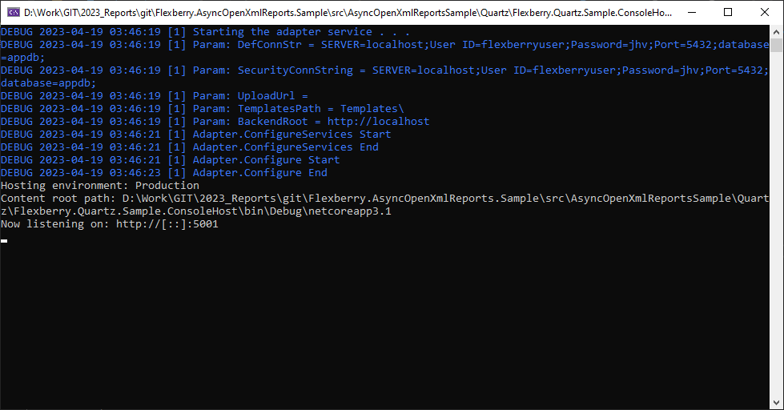

# Реализация связки Host+WebHost в консольном приложении на .NET Core 3.1

## Цель
Создать консольное приложение на .NET Core 3.1, которое на определенном порту предоставляет некоторый Rest интерфейс.

## Варианты реализации
Для этих целей можно использовать только **Microsoft.AspNetCore.WebHost**. Но это не позволит настроить **Dependency Injection**, с использованием контейнера **Unity.IUnityContainer**.

# Реализация
## 1. Добавляем наш класс, назовем его **Adapter**, добавляем метод **OnStart**, в котором будет происходить инициализация основного сервиса.

Вот почему в консольном приложении будет только [вызов старта адаптера](https://github.com/Flexberry/Flexberry.AsyncOpenXmlReports.Sample/blob/6dac7f45402152b09a57b70e86d139d7a6881c93/src/AsyncOpenXmlReportsSample/Quartz/Flexberry.Quartz.Sample.ConsoleHost/Program.cs#L13), остальное будет происходить внутри.
```C#
private static void Main(string[] args)
{
    var adapter = new Adapter();
    adapter.OnStart();
    Console.WriteLine("Adapter service host is started. Press any key to stop it and exit . . .");
}
```

## 2. [Инициализируем](https://github.com/Flexberry/Flexberry.AsyncOpenXmlReports.Sample/blob/6dac7f45402152b09a57b70e86d139d7a6881c93/src/AsyncOpenXmlReportsSample/Quartz/Flexberry.Quartz.Sample.Service/Adapter.cs#L150) **Microsoft.Extensions.Configuration.IConfiguration** из файла конфигурации, например **adapterSettings.json**

```C#
// Конфигурация.
Configuration = new ConfigurationBuilder()
    .AddJsonFile("adapterSettings.json", optional: false, reloadOnChange: false)
    .AddEnvironmentVariables()
    .Build();
```

Метод **AddEnvironmentVariables** добавит или обновит значения конфигурации, исходя из переменных окружения. [Например](https://github.com/Flexberry/Flexberry.AsyncOpenXmlReports.Sample/blob/6dac7f45402152b09a57b70e86d139d7a6881c93/src/Docker/docker-compose.yml#L55), если запуск происходит из **docker**, и надо поменять строку соединения, путь до ресурсов и т.п.

## 3. [Поднимаем и запускаем хост](https://github.com/Flexberry/Flexberry.AsyncOpenXmlReports.Sample/blob/6dac7f45402152b09a57b70e86d139d7a6881c93/src/AsyncOpenXmlReportsSample/Quartz/Flexberry.Quartz.Sample.Service/Adapter.cs#L109) **Microsoft.Extensions.Hosting.Host**

```C#
// Построение хоста.
var builder = Host.CreateDefaultBuilder()

    // Добавляем файл конфигурации.
    .ConfigureAppConfiguration(cfg =>
    {
        cfg.AddJsonFile("adapterSettings.json").AddEnvironmentVariables();
    })

    // Включаем использование unity.
    .UseUnityServiceProvider(Container)

    // Настраиваем контейнер.
    .ConfigureContainer<IUnityContainer>(adapterStartup.ConfigureContainer)

    // Настраиваем сервисы.
    .ConfigureServices((hostContext, services) =>
    {
        // Добавляем сервис адаптера.
        services.AddHostedService<AdapterService>();
    });

host = builder.Build();

// Запускаем хост.
host.Run();
```

**ConfigureAppConfiguration** - добавление конфигурации;

**UseUnityServiceProvider** - использование Unity. Для этого надо подключить **Unity.Microsoft.DependencyInjection**. Контейнер используем статичный;

**ConfigureContainer** - настройка нашего контейнера. Указываем метод в котором будет происходить настройка сервисов и интерфейсов;

**ConfigureServices** - настройка сервисов. В нашем случае там будет один сервис, который запустит **WebHost**.

## 4. [Добавляем сервис](https://github.com/Flexberry/Flexberry.AsyncOpenXmlReports.Sample/blob/6dac7f45402152b09a57b70e86d139d7a6881c93/src/AsyncOpenXmlReportsSample/Quartz/Flexberry.Quartz.Sample.Service/AdapterService.cs#L15), в котором будет происходить запуск **WebHost**, пусть это будет **AdapterService**.

Его нужно унаследовать от **Microsoft.Extensions.Hosting.IHostedService** и добавить реализации этого интерфейса.

## 5. [Поднимаем и запускаем веб](https://github.com/Flexberry/Flexberry.AsyncOpenXmlReports.Sample/blob/6dac7f45402152b09a57b70e86d139d7a6881c93/src/AsyncOpenXmlReportsSample/Quartz/Flexberry.Quartz.Sample.Service/AdapterService.cs#L33) **Microsoft.AspNetCore.WebHost**

```C#
// Построение веб-хоста.
var builder = WebHost.CreateDefaultBuilder()

    // Добавляем конфигурацию.
    .UseConfiguration(Adapter.Configuration)

    // Добавляем IIS.
    .UseIISIntegration()

    // Включаем использование unity.
    .UseUnityServiceProvider(Adapter.Container)

    // Настройка севрисов.
    .ConfigureServices(adapterStartup.ConfigureServices)

    // Общая настройка.
    .Configure(adapterStartup.Configure);

host = builder.Build();

// Запуск веб-хоста.
return host.RunAsync(cancellationToken);
```

**UseConfiguration** - добавление конфигурации;

**UseIISIntegration** - добавление интеграции с IIS;

**UseUnityServiceProvider** - использование Unity. Для этого надо подключить **Unity.Microsoft.DependencyInjection**. Контейнер используем тот же, что и с основным хостом;

**ConfigureServices** - настройка сервисов;

**Configure** - общие настройки веб-хоста, тут мы регистрируем нужные нам контроллеры, [например **QuartzController**](https://github.com/Flexberry/Flexberry.AsyncOpenXmlReports.Sample/blob/6dac7f45402152b09a57b70e86d139d7a6881c93/src/AsyncOpenXmlReportsSample/Quartz/Flexberry.Quartz.Sample.Service/Controllers/QuartzController.cs#L17).

### Настройка порта находится в файле конфигурации:
```json
"Urls": "http://*:5001"
```

## Окно запуска
